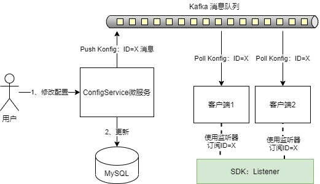

### Introduce - 介绍

<!-- START doctoc generated TOC please keep comment here to allow auto update -->
<!-- DON'T EDIT THIS SECTION, INSTEAD RE-RUN doctoc TO UPDATE -->


- [Introduce - 介绍](#introduce---%E4%BB%8B%E7%BB%8D)
  - [简介](#%E7%AE%80%E4%BB%8B)
  - [特性](#%E7%89%B9%E6%80%A7)
  - [配置推送原理](#%E9%85%8D%E7%BD%AE%E6%8E%A8%E9%80%81%E5%8E%9F%E7%90%86)
- [Quick Start - 快速开始](#quick-start---%E5%BF%AB%E9%80%9F%E5%BC%80%E5%A7%8B)
  - [(1) 单独使用](#1-%E5%8D%95%E7%8B%AC%E4%BD%BF%E7%94%A8)
  - [(2) 与Spring Boot整合使用](#2-%E4%B8%8Espring-boot%E6%95%B4%E5%90%88%E4%BD%BF%E7%94%A8)
- [FAQ - 常见问题](#faq---%E5%B8%B8%E8%A7%81%E9%97%AE%E9%A2%98)

<!-- END doctoc generated TOC please keep comment here to allow auto update -->

---

#### 简介

该项目是适用于 [[Konfig](https://github.com/Leisurelybear/konfig)] 项目的Java SDK，主要用来对Konfig进行读取操作，方便开发时候使用。<br/>

#### 特性

- 通过方法调用获取配置。
- 为程序添加配置变更监听器，在配置变更时候执行回调方法。

#### 配置推送原理



### Quick Start - 快速开始

> 首先部署Konfig后，在管理页面添加需要的配置信息。

#### (1) 单独使用

a. 首先pom.xml中添加依赖

```xml
        <dependency>
            <groupId>ml.zhangxujie</groupId>
            <artifactId>konfig-sdk-java</artifactId>
            <version>1.0.0</version>
        </dependency>
```

b1. 获取配置

```java
import ml.zhangxujie.konfig.KonfigClient;
import ml.zhangxujie.konfig.dto.konfig.KonfigCollection;
import java.util.Map;

//获取配置的Demo
public class KonfigGetExample {
    
    //1. 首先定义一个唯一appId
    public static final String appId = "test";

    public static void main(String[] args) {
        //2. 内部使用单例模式获取Client的实例对象
        KonfigClient client = KonfigClient.getKonfigClient(appId);
        
        //3. 获取CollectionId = 20的配置集
        KonfigCollection konfigCollection = client.getConfig(20);

        //4. 转换配置集中的配置列表为Map
        Map konfigMap = client.convertKonfigListToMap(konfigCollection.getConfigList());
        
        //5. 获取 ID：20 配置集中 Key=hello 的配置 Value， 如果没有，则为null
        System.out.println(konfigMap.get("hello"));
        
        //6. 获取 ID：20 配置集中 Key=db_ip 的配置 Value， 如果没有，则为null
        System.out.println(konfigMap.get("db_ip"));
    }
}

```

b2. 添加监听器

```java
import ml.zhangxujie.konfig.KonfigClient;
import ml.zhangxujie.konfig.dto.konfig.Konfig;
import ml.zhangxujie.konfig.event.KonfigEventListener;
import ml.zhangxujie.konfig.event.KonfigEventObject;
import ml.zhangxujie.konfig.event.KonfigEventObjectSource;

//使用监听器的Demo
public class EventListenerExample {

    public static void main(String[] args) {
        
        //1. 通过唯一appId获取Client实例
        KonfigClient client = KonfigClient.getKonfigClient("test-e1");

        //2. 为 CollectionId=20 的配置集添加监听器。
        client.addEventListener(20, new KonfigEventListener() {
            @Override
            public void OnChanged(KonfigEventObject konfigEventObject) {
                //3. 实现方法，当配置改变时，konfigEventObject 会自动获取到最新配置信息，用户可在此方法内实现需要的操作。
                String ip = konfigEventObject
                    .getKonfigCollection()
                    .getConfigList().get(2).getValue();
                System.out.println(ip);

                Konfig konfig = konfigEventObject.getKonfig("hello");
                System.out.println(konfig);

            }
        });


        // 为 CollectionId=19 的配置集添加监听器。
        client.addEventListener(19, new KonfigEventListener() {
            @Override
            public void OnChanged(KonfigEventObject konfigEventObject) {
                // 当配置变更时候，会自动执行 OnChanged 方法的逻辑。
                KonfigEventObjectSource source = konfigEventObject.getSource();
                System.out.println("19:test: onChanged! - " + source);
            }
        });
    }
}

```


#### (2) 与Spring Boot整合使用

a. 首先 **pom.xml** 中添加依赖

```xml
        <dependency>
            <groupId>ml.zhangxujie</groupId>
            <artifactId>konfig-sdk-java</artifactId>
            <version>1.0.0</version>
        </dependency>
```

b. 在配置目录下，添加一个 **IOC** 配置类，支持依赖注入

```java
import ml.zhangxujie.konfig.KonfigClient;
import org.springframework.context.annotation.Bean;
import org.springframework.context.annotation.Configuration;

@Configuration
public class ApplicationContext {

    @Bean
    public KonfigClient getKonfigClient(){
        //这里返回 唯一 AppId 的 Client
        return KonfigClient.getKonfigClient("my-appID");
    }

}

```

c. 实现业务类，这里展示了 **Controller** 层

```java
import ml.zhangxujie.konfig.KonfigClient;
import ml.zhangxujie.konfig.dto.konfig.Konfig;
import ml.zhangxujie.konfig.dto.konfig.KonfigCollection;
import ml.zhangxujie.konfig.event.KonfigEventListener;
import ml.zhangxujie.konfig.event.KonfigEventObject;
import org.springframework.http.HttpStatus;
import org.springframework.http.ResponseEntity;
import org.springframework.web.bind.annotation.CrossOrigin;
import org.springframework.web.bind.annotation.GetMapping;
import org.springframework.web.bind.annotation.RequestMapping;
import org.springframework.web.bind.annotation.RestController;

import javax.annotation.Resource;
import java.util.List;

@RestController
@RequestMapping("/banner")
@CrossOrigin
public class BannerController {

    @Resource
    private KonfigClient konfigClient;

    @GetMapping("/list")
    public ResponseEntity list(){

        // 获取配置集合ID为25的配置
        KonfigCollection konfigCollection = konfigClient.getConfig(25);

        System.out.println(konfigCollection);

        List<Konfig> konfigList = konfigCollection.getConfigList();

        return new ResponseEntity(konfigList, HttpStatus.OK);
    }

    @GetMapping("/auto")
    public ResponseEntity autolist(){

        //为配置集合赋予初始值，因为需要监听器内修改，所以需要定义为 数组指针类型引用
        final KonfigCollection[] konfigCollection = {konfigClient.getConfig(25)};

        // 为配置集[id=25]添加监听器，每次配置改变，则改变 konfigCollection 的值为最新的值。
        konfigClient.addEventListener(25, new KonfigEventListener() {
            @Override
            public void OnChanged(KonfigEventObject konfigEventObject) {
                konfigCollection[0] = konfigEventObject.getKonfigCollection();
            }
        });
        System.out.println(konfigCollection[0]);

        //每次都可以获取最新的配置
        List<Konfig> konfigList = konfigCollection[0].getConfigList();

        return new ResponseEntity(konfigList, HttpStatus.OK);
    }

}
```

d. 前端获取

```javascript
// 比如我们可以通过jQuery的Ajax获取
// 每次调用，都会获取最新的配置。
			$.ajax({
                url: 'http://serverIP:port/banner/auto',
                type: 'get',
                dataType: 'json',
                success: function (data) {
                    console.log(data)
                    $(data).each(function (i, val) {
                        console.log(val)
                        str = "<li'>" +
                            "    <a href='https://zhangxujie.ml/' target='_blank'>" +
                            "        " +
                            "    </a>\n" +
                            "</li>";
                        $("#banner-ul").append(str);
                    })
                }
            })
```


### FAQ - 常见问题

1. 日志类冲突问题

   1. 问题：类路径中包含多个 **SLF4J** 的实现

      > SLF4J: Class path contains multiple SLF4J bindings.
      > SLF4J: See http://www.slf4j.org/codes.html#multiple_bindings for an explanation.
      > Exception in thread "restartedMain" java.lang.reflect.InvocationTargetException
      > 	at sun.reflect.NativeMethodAccessorImpl.invoke0(Native Method)
      > 	at sun.reflect.NativeMethodAccessorImpl.invoke(NativeMethodAccessorImpl.java:62)
      > 	at sun.reflect.DelegatingMethodAccessorImpl.invoke(DelegatingMethodAccessorImpl.java:43)
      > 	at java.lang.reflect.Method.invoke(Method.java:498)
      > 	at org.springframework.boot.devtools.restart.RestartLauncher.run(RestartLauncher.java:49)
      > Caused by: java.lang.IllegalArgumentException: LoggerFactory is not a Logback LoggerContext but Logback is on the classpath. Either remove Logback or the competing implementation...

   2. 解决方法：改变 **pom.xml** 依赖，从依赖中排除 **slf4j-simple**，改为如下内容

      ```xml
              <dependency>
                  <groupId>ml.zhangxujie</groupId>
                  <artifactId>konfig-sdk-java</artifactId>
                  <version>1.0.0</version>
                  <exclusions>
                      <exclusion>
                          <artifactId>slf4j-simple</artifactId>
                          <groupId>org.slf4j</groupId>
                      </exclusion>
                  </exclusions>
              </dependency>
      ```